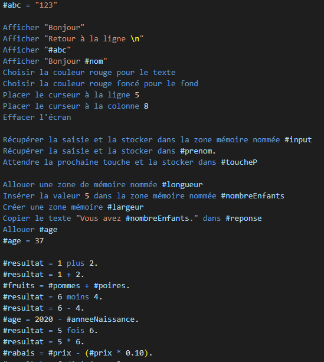

# cosmos-extension

## Features

## Requirements

- You should install the language cosmos from this [repo](https://github.com/jonathanMelly/cosmos)

## Known Issues

- Right now the extension only work on file named Main.cosmos

**If you want more information about the project click [here !](../README.md)**

**Enjoy!**
